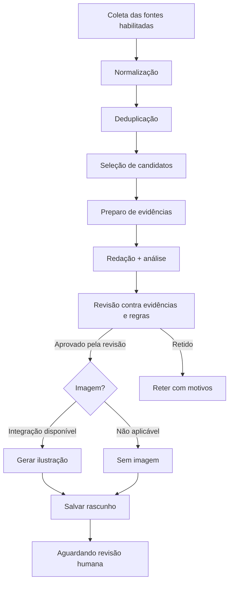
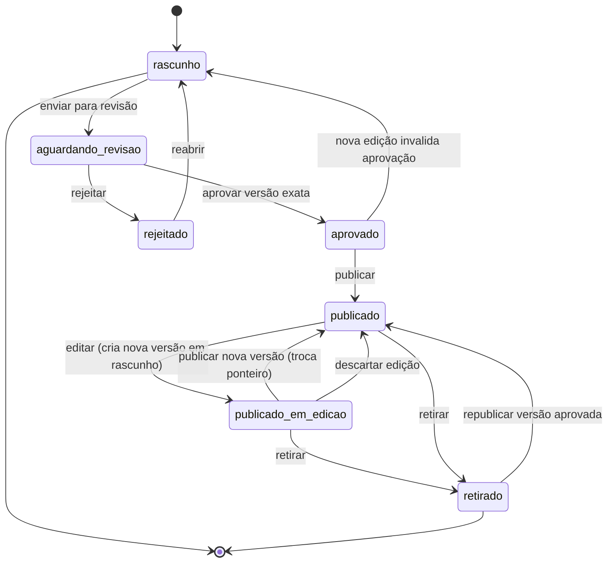
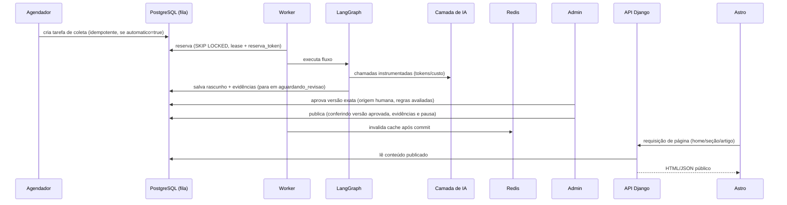
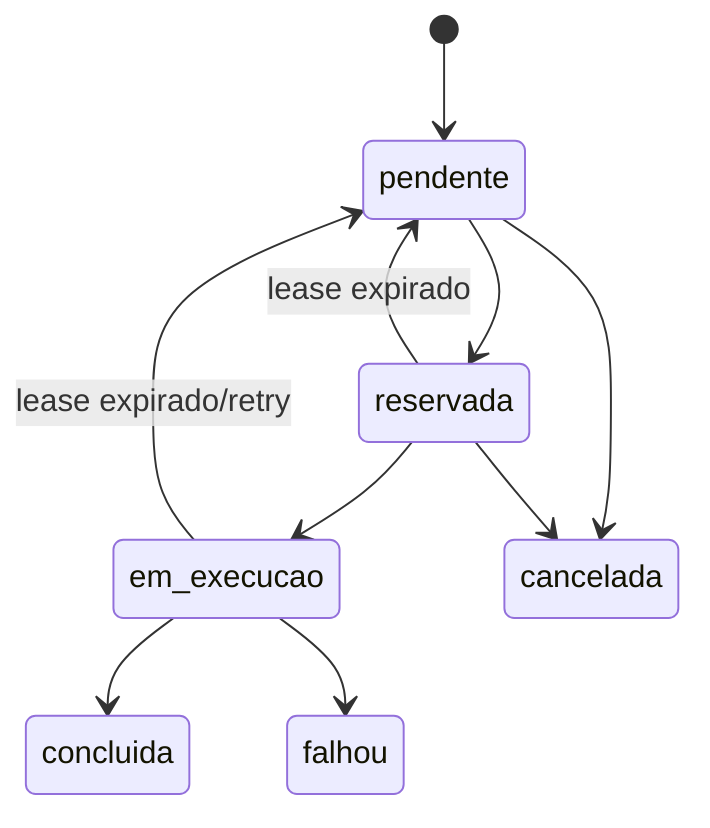

# Especificação — Published Tech

| Campo | Valor |
|---|---|
| Documento | Especificação funcional e não funcional do sistema Published Tech |
| Versão | 0.2 (decisões do grill aplicadas) |
| Data | 2026-10-08 |
| Status | Pronto para etapa de arquitetura e geração de épicos/issues |
| Escopo desta etapa | Requisitos, fluxos, estados, regras e critérios de aceitação. **Sem código, sem deploy, sem issues externas, sem escolha de serviços pagos.** |
| Idioma | Português brasileiro |
| Vocabulário | `GLOSSARY.md` (termos canônicos) |
| Decisões estruturais | `docs/adr/` (0001 fila PostgreSQL; 0002 aprovação humana; 0003 render-once-and-cache) |

## Convenções de leitura

Ao longo do documento, cada afirmação relevante é classificada com uma etiqueta:

- **[DEC]** — **Decisão confirmada.** Faz parte da base do projeto.
- **[REC]** — **Recomendação de especificação.** Proposta do autor para preencher uma lacuna, com justificativa. Não é decisão aprovada.
- **[ABT]** — **Ponto em aberto.** Depende de decisão futura do responsável.
- **[EVO]** — **Evolução futura.** Fora da primeira entrega.

Nenhuma recomendação neste documento deve ser lida como aprovada. Onde não houve confirmação, o texto diz explicitamente que é proposta.

### Limitações de verificação externa

As capacidades de APIs e bibliotecas citadas foram verificadas em 2026-10-08 nas fontes oficiais listadas na seção 27. Onde não foi possível confirmar, a limitação está registrada no próprio texto. Nenhuma versão é apresentada como "mais recente" sem verificação.

---

## 1. Visão, objetivos, público e glossário

### 1.1 Visão

**[DEC]** Published Tech é o nome de trabalho de um portal em português voltado a desenvolvedores e profissionais de tecnologia, com foco em IA, software e infraestrutura. O produto explica e analisa acontecimentos e ferramentas — contexto, limitações e impacto prático — num formato próximo de um "react" escrito, com contribuição editorial substancial. Não é um mecanismo de copiar, traduzir ou apenas trocar palavras de reportagens de terceiros.

### 1.2 Objetivos

| # | Objetivo | Classificação |
|---|---|---|
| O1 | Ser um produto editorial utilizável e publicamente acessível | [DEC] |
| O2 | Demonstrar capacidade de engenharia em backend, IA, automação, processamento assíncrono e operação observável | [DEC] |
| O3 | Operar de forma autônoma quando autorizado, com controle administrativo | [DEC] |
| O4 | Gerar receita | [EVO] — não é objetivo inicial |

### 1.3 Público

- **[DEC]** Leitor principal: desenvolvedores e profissionais de tecnologia, em português.
- **[REC]** Leitor secundário: pessoas tomando decisões técnicas (avaliar bibliotecas, modelos e infraestrutura).
- **[DEC]** Operador do sistema: administrador único (seção 7), inicialmente Rogério. Papéis adicionais são evolução (REC-11).

### 1.4 Glossário

| Termo | Definição |
|---|---|
| Fonte (source) | Origem de dados coletados (ex.: GitHub, Hugging Face). |
| Conector | Componente que consulta uma fonte e normaliza os registros. |
| Registro bruto | Dado como retornado pela fonte, antes de normalização. |
| Registro normalizado | Dado convertido para o modelo interno comum. |
| Evidência | Referência verificável (URL, metadado, snippet datado) que sustenta uma afirmação do texto. |
| Candidato | Registro normalizado selecionado para possível virar matéria. |
| Execução (run) | Uma passagem completa do motor por uma determinada coleta/seleção/redação. |
| Conteúdo | Unidade editorial (matéria, resumo de destaque, radar) com versões. |
| Versão | Snapshot imutável do conteúdo em um momento. |
| Rascunho | Conteúdo gerado, ainda não aprovado. |
| Aprovação | Decisão humana que autoriza publicar uma versão exata. |
| Publicação | Ato de tornar uma versão aprovada visível publicamente. |
| Tarefa (job) | Unidade de trabalho persistida na fila PostgreSQL. |
| Worker | Processo Python que reserva e executa tarefas. |
| Lease | Reserva temporária de uma tarefa por um worker, com expiração. |
| Liveness | Sinal periódico de que um worker está vivo. |
| Orçamento | Limite configurável de gasto (diário/mensal) que bloqueia novos gastos. |
| Chamada de IA | Uma invocação de modelo instrumentada pela camada comum (seção 9). |
| Snapshot de configuração | Cópia imutável das configurações vigentes no início de uma execução. |
| Modo simulado | Execução sem credenciais e sem gasto, com IA e imagens simuladas. |
| Modo integrado | Execução com conectores reais; IA real só após configuração explícita. |
| Trending (GitHub) | Lista curada internamente pelo GitHub em github.com/trending; **não** exposta por API oficial. |
| trendingScore (Hugging Face) | Métrica interna de tendência retornada pela API do Hub. |

---

## 2. Registro de decisões confirmadas, recomendações e pendências

### 2.1 Decisões confirmadas (base do projeto)

| ID | Decisão |
|---|---|
| DEC-01 | Frontend público: Astro + Tailwind CSS; React + shadcn/ui só onde houver interação. |
| DEC-02 | Backend: Django. |
| DEC-03 | Banco: PostgreSQL para conteúdo, configurações, fila, agendamentos e histórico. |
| DEC-04 | Executor: workers Python próprios; **sem Celery**. |
| DEC-05 | Fluxo editorial: LangGraph, inicialmente básico. |
| DEC-06 | Redis exclusivamente para cache do site; **não** é broker nem fila. |
| DEC-07 | CDN não integrada agora; manter compatibilidade futura. |
| DEC-08 | Ambiente inicial: desenvolvimento e teste local; Docker Compose como proposta de empacotamento. |
| DEC-09 | Fontes iniciais: GitHub e Hugging Face, cadastradas como **instâncias configuráveis** (cadastrar, editar, desativar, excluir). Criar um **tipo novo** de fonte exige um conector novo (código), não é configuração. |
| DEC-10 | Demais fontes de notícias: definição posterior; prever extensão sem inventar fontes. |
| DEC-11 | IA por interface substituível; **OpenRouter é o gateway padrão** (uma credencial, vários modelos); preços em **USD**. No desenvolvimento: modelos **full free** da OpenRouter para texto; **geração de imagem mocada** (tool simulada) usando **uma única imagem de placeholder**. |
| DEC-12 | Imagens editoriais geradas por IA, com identidade visual consistente e identificação como ilustração. |
| DEC-13 | Estilo: português direto, análise prática e humor leve configurável. |
| DEC-14 | Limites de frequência, volume, tentativas e orçamento configuráveis. |
| DEC-15 | Observabilidade: logs por execução e chamada, tokens, tempo, custos e relatórios filtráveis. |
| DEC-16 | MVP inicia em modo rascunho e aprovação manual. |
| DEC-17 | O motor executa **automaticamente todas as etapas até gerar o rascunho** (coleta, seleção, evidências, redação, revisão e ilustração) quando o flag booleano `automatico` estiver `true` (padrão `false`). A **publicação nunca é automática no MVP**: todo rascunho vai para a tela de rascunhos e depende de **aprovação humana** de uma versão exata. O flag **não** autoriza publicação. |
| DEC-18 | Administrador inicial: **Django Admin padrão, com personalização mínima** (não é interface pública; sem investimento em design). Painel próprio é evolução. |

### 2.2 Recomendações de especificação (não aprovadas)

| ID | Recomendação | Justificativa |
|---|---|---|
| REC-01 | **Escopo da personalização** do Django Admin: **mínimo funcional** — registro dos modelos, `list_display`/`list_filter`/`search_fields` básicos, inlines e as ações necessárias (aprovar/rejeitar/publicar/retirar/cancelar/invalidar). Sem investir em UI, pois o admin não é público. Painel próprio só como evolução. | Reduz esforço; o admin não aparece ao usuário. |
| REC-02 | Versionar configurações e prompts em tabelas próprias, com comparação, restauração e teste em prévia privada. | Rastreabilidade e segurança editorial. |
| REC-03 | Fila única persistente no PostgreSQL com reserva atômica via `SELECT ... FOR UPDATE SKIP LOCKED` e lease. | Simples, sem broker externo; suporta múltiplos workers. |
| REC-04 | Execuções usam **snapshot** de configuração; alterações posteriores não afetam execuções em andamento nem registros históricos. | Reprodutibilidade e auditoria. |
| REC-05 | Timezone de armazenamento UTC; exibição e fechamento de orçamento em `America/Sao_Paulo`. | Consistência e alinhamento do operador. |
| REC-06 | Custos em moeda original com precisão decimal; conversão para BRL apenas como estimativa com câmbio datado. | Evita somas falsas e taxas inventadas. |
| REC-07 | Busca pública classificada como evolução (fora do MVP). | Mantém o MVP focado; o conteúdo é navegável por seções e arquivo. |
| REC-08 | Exigir confirmação explícita e registrar em log de auditoria toda alternância do flag `automatico`; usar sempre a configuração **atual** como autorização, com o snapshot apenas para rastreabilidade. | Evita automação acidental e publicação após desativação. |
| REC-13 | O flag `automatico` controla somente a **execução automática do pipeline até o rascunho**; a publicação permanece humana no MVP. | Alinha automação ao controle editorial. |
| REC-09 | Conectores implementados como adaptadores com contrato comum e registro plugável. | Permite adicionar fontes futuras sem reescrever o motor. |
| REC-10 | LLM e geração de imagem atrás de uma interface interna única, com camada de instrumentação obrigatória. | Substituição de provedor e contabilização uniforme. |
| REC-11 | Papéis futuros de editor/revisor modelados desde já, mas com um único administrador ativo no MVP. | Evita migração dolorosa sem exigir multiusuário agora. |
| REC-12 | Sitemap e metadados gerados dinamicamente a partir do conteúdo publicado. | SEO sem rebuild integral. |

### 2.3 Pontos em aberto

| ID | Ponto em aberto | Impacto se não resolvido | Recomendação de contorno |
|---|---|---|---|
| ABT-01 | Domínio e marca definitivos | Nenhum no MVP (nome de trabalho) | Prosseguir; parametrizar domínio. |
| ABT-02 | Identidade visual final | Nenhum; provisória basta | Usar referências provisórias aprovadas. |
| ABT-03 | Modelo pago de **texto** e provedor real de **imagem** para produção | Não bloqueia o dev (texto free + imagem mocada) | Interface substituível + preços em USD; escolher depois. |
| ABT-04 | Política detalhada do ranking de GitHub e Hugging Face | Afeta qualidade editorial, não a arquitetura | Critérios iniciais definidos na seção 4; ajustáveis. |
| ABT-07 | Perfis de usuários (editor/revisor) | Não bloqueia MVP de administrador único | Modelar papéis, ativar só depois (REC-11). |
| ABT-08 | Busca é MVP? | Afeta escopo do site | Recomendação: evolução (REC-07). |
| ABT-09 | Fontes de notícias futuras | Não bloqueia; prever extensão | Abstração de conectores (REC-09). |
| ABT-10 | Alcance definitivo da automação: se e quando a publicação poderá dispensar aprovação humana. | Não bloqueia o MVP; publicação humana está confirmada | Recomendação: manter publicação sempre humana no MVP; tratar dispensa de revisão como evolução (EVO-01). |

### 2.4 Evoluções futuras

| ID | Evolução |
|---|---|
| EVO-01 | Publicação automática (dispensa de aprovação humana) e políticas adaptativas de autonomia, além do flag de execução. |
| EVO-02 | Painel administrativo próprio (React/shadcn). |
| EVO-03 | Busca pública. |
| EVO-04 | CDN operacional. |
| EVO-05 | Fontes jornalísticas adicionais. |
| EVO-06 | Múltiplos usuários com papéis editor/revisor. |
| EVO-07 | Loops editoriais mais complexos (reescrita iterativa, múltiplos agentes). |
| EVO-08 | Monetização (AdSense, afiliados) e hospedagem de produção. |
| EVO-09 | Fine-tuning / modelos locais como provedores. |
| EVO-10 | Testes de desempenho e comparação de modelos (benchmarks próprios). |

---

## 3. Escopo MVP, evoluções e exclusões

### 3.1 Escopo do MVP

**[DEC]** O MVP entrega:

1. Coleta real de GitHub e Hugging Face em modo integrado (ou fixtures em modo simulado).
2. Fila persistente em PostgreSQL, worker, agendador e recuperação de falhas.
3. Pipeline LangGraph inicial (coleta/normalização → deduplicação/seleção → evidências → redação → revisão → ilustração opcional → rascunho).
4. Ciclo editorial com aprovação manual: rascunho → aguardando revisão → aprovado → publicado → retirado, mais rejeição.
5. Django Admin personalizado para revisão, configuração, tarefas, logs, custos e relatórios.
6. Site público Astro renderizando home, seções/categorias, artigos, destaque GitHub e radar Hugging Face.
7. Site público com **render-once-and-cache** (ADR-0003), com invalidação por evento (publicar/editar/trocar versão/retirar).
8. Instrumentação completa de chamadas de IA, com tokens, duração e custos, e orçamento bloqueante.
9. Ambiente local reproduzível com Docker Compose e testes significativos (concorrência, idempotência, falhas).
10. Transparência editorial e identificação de conteúdo/ilustração gerados por IA.

### 3.2 Fora do MVP

- **[EVO]** AdSense, afiliados e monetização.
- **[EVO]** CDN operacional e hospedagem de produção.
- **[EVO]** Fontes jornalísticas não aprovadas.
- **[EVO]** Painel React completo por padrão.
- **[EVO]** Loops editoriais complexos.
- **[EVO]** Infraestrutura distribuída desnecessária (Kubernetes, microserviços, brokers).
- **[DEC]** O motor executa o pipeline automaticamente até o rascunho via flag `automatico` (DEC-17); a **publicação é sempre humana** no MVP.
- **[EVO]** Publicação automática (dispensa de aprovação humana) — apenas preparada por estados/auditoria, não implementada (ABT-10).
- **[EVO]** Busca pública e múltiplos usuários.

### 3.3 Exclusões explícitas (nunca reintroduzir sem registrar mudança de decisão)

- **[DEC]** Celery, RabbitMQ, NATS, Kubernetes e microserviços estão **excluídos** da base. Qualquer reintrodução exige registro explícito de mudança de decisão (ADR) antes de implementar.

---

## 4. Áreas editoriais

### 4.0 Fontes e conectores

- **[DEC]** Fontes são **instâncias de tipos suportados** (inicialmente GitHub e Hugging Face), cadastradas no Django Admin: **cadastrar, editar, desativar e excluir**. Cada instância tem rótulo, tipo, parâmetros e estado ativo/inativo.
- **[DEC]** O **tipo** de fonte determina o conector (código). Criar um tipo novo exige implementar um conector (REC-09), não é configuração.
- **[DEC]** O motor só coleta de fontes **habilitadas**; desativar uma fonte interrompe novas coletas dela sem apagar o histórico.

### 4.1 GitHub — curadoria (frequência e quantidade configuráveis)

**[DEC]** Seção de repositórios em destaque, com quantidade e periodicidade **configuráveis**. Padrão: **1 repositório por dia** [REC] (teto 5), frequência padrão diária, ambos ajustáveis.

**[DEC]** O nome da seção deve indicar curadoria própria quando houver filtros editoriais. **Não** afirmar que é o ranking oficial do GitHub.

#### 4.1.1 Descoberta x acompanhamento

- **[DEC]** Separar **descoberta diária** (repositórios candidatos encontrados em uma janela) de **acompanhamento contínuo** (projetos que o administrador fixou/acompanha).
- **[DEC]** O administrador pode **fixar**, **acompanhar**, **excluir** e **deixar de acompanhar** projetos.
- **[DEC]** Detectar releases e mudanças relevantes sem gerar notícia para cada commit ou alteração de documentação. São elegíveis para "mudança relevante": novo release/tag com notas, mudança de licença, mudança de descrição/finalidade, crescimento anômalo em janela curta.
- **[REC]** Não gerar matéria para mudança de README ou de documentação isolada, salvo quando alterar a finalidade declarada.

#### 4.1.2 Limitação verificada e alternativa

**[DEC]** A ordenação por estrelas totais **não** equivale ao GitHub Trending.

**Verificação (2026-10-08):** o GitHub **não** publica API oficial para a página Trending. A REST API oferece `GET /search/repositories` com `sort` limitado a `stars`, `forks`, `help-wanted-issues` e `updated`, além de qualificadores `stars:`, `created:`, `pushed:`, `language:`, `topic:`. Limites: busca autenticada até 30 req/min (10 req/min não autenticada); a busca considera um **escopo de até 4.000 repositórios** que casam com os filtros; e a paginação torna **recuperáveis apenas os primeiros 1.000 resultados**. São dois limites distintos (escopo x recuperação) e ambos restringem a descoberta. Fonte: <https://docs.github.com/en/rest/search/search> e <https://docs.github.com/en/search-github/searching-on-github/searching-for-repositories> (verificado em 2026-10-08). A página <https://github.com/trending> não possui endpoint documentado.

**[REC]** Alternativa de descoberta **sem scraping de endpoint não documentado**:
1. Consultar `GET /search/repositories` com qualificadores datados: `created:>=<data-início> stars:>=<mínimo>` e/ou `pushed:>=<data-início> stars:>=<mínimo>`, `sort=stars`, `order=desc`.
2. Aplicar filtros editoriais próprios (tema, licença, maturidade, idioma, ausência de conteúdo gerado/duplicado).
3. Calcular uma **pontuação editorial da curadoria** (não do GitHub) e deixar claro na interface que é curadoria própria.
4. Marcar sempre a seção com aviso de curadoria e data da coleta.

**[ABT]** Se o scraping da página Trending será autorizado no futuro. Enquanto não houver decisão e análise das condições de uso, **não** assumir scraping autorizado nem estabilidade de endpoints não documentados.

#### 4.1.3 Campos por repositório

**[DEC]** Para cada repositório em destaque, prever:

| Campo | Obrigatório | Observação |
|---|---|---|
| Identificador estável | Sim | ID numérico da API, além de `owner/name`. |
| Proprietário/nome | Sim | |
| URL | Sim | |
| Descrição própria em português | Sim | Contribuição editorial, não tradução literal. |
| Finalidade | Sim | |
| Público indicado | Recomendado | |
| Linguagem | Quando disponível | |
| Licença declarada | Quando disponível | "Desconhecida" quando ausente. |
| Métricas com data da coleta | Sim | Estrelas, forks, issues abertas, data. |
| Razões da seleção | Sim | Ligadas aos critérios de curadoria. |
| Limitações | Sim | |
| Links das evidências | Sim | URL do repo, release, metadados. |

### 4.2 Hugging Face — radar (frequência e quantidade configuráveis)

**[DEC]** Seção de modelos em destaque, com quantidade, período e filtros **configuráveis**. Padrão: **1 modelo por semana** [REC] (teto 5), frequência padrão semanal, ambos ajustáveis.

#### 4.2.1 Distinções obrigatórias

**[DEC]** Distinguir, para cada item:

1. Lançamento confirmado de modelo.
2. Modelo antigo que ganhou atenção.
3. Nova variante, quantização ou fine-tuning.
4. Atualização de repositório sem lançamento.

**[REC]** Agrupar variantes da mesma família (ex.: múltiplas quantizações GGUF do mesmo modelo-base) para evitar que o ranking seja preenchido por equivalentes.

#### 4.2.2 Capacidades verificadas

**Verificação (2026-10-08):** o endpoint público `https://huggingface.co/api/models` aceita `sort`, `direction`, `limit` e `full=true`. Conferido ao vivo que `sort=trendingScore&direction=-1&full=true` retorna, por modelo: `id`, `trendingScore`, `downloads`, `likes`, `createdAt`, `lastModified`, `pipeline_tag`, `library_name` e `tags`. A biblioteca `huggingface_hub` expõe `list_models(...)` com os mesmos parâmetros (`sort`, `direction`, `limit`, `full`, `cardData`). Fontes: <https://huggingface.co/docs/hub/api>, <https://huggingface.co/docs/huggingface_hub/guides/search> e OpenAPI em <https://huggingface.co/.well-known/openapi.json> (verificado em 2026-10-08). A API está sujeita a limites de taxa do Hub.

**[REC]** Estratégia de seleção semanal: combinar `sort=trendingScore` e `sort=createdAt` (ambos desc) numa janela de 7 dias, filtrar por tarefa/modalidade configurável e agrupar famílias.

#### 4.2.3 Campos por modelo

**[DEC]** Registrar: organização/autoria, URL, tarefa/modalidade, parâmetros quando documentados, formatos, relação com modelo-base, licença declarada, acesso restrito quando aplicável, métricas datadas, anúncio e evidências de lançamento.

#### 4.2.4 Regras de veracidade

- **[DEC]** **Não** usar criação do repositório nem último commit como comprovação automática da data de lançamento.
- **[DEC]** Separar **metadado coletado** de **informação verificada** (campo de estado no modelo de evidência).
- **[DEC]** VRAM, desempenho e compatibilidade só com fonte ou teste; **estimativas** exigem rótulo e premissas.
- **[DEC]** Informação ausente permanece **desconhecida** — nunca inferida silenciosamente.
- **[DEC]** Popularidade não é garantia de qualidade, segurança ou desempenho.
- **[DEC]** Não alegar testes realizados quando a análise se baseou apenas em documentação.

### 4.3 Notícias comentadas (modelo editorial futuro)

**[DEC]** Prever o modelo editorial, **sem integrar** veículos ainda não escolhidos.

**[REC]** Estrutura sugerida: contexto breve → análise → consequências práticas → limitações → fontes.

**[DEC]** Distinguir fatos, alegações do fornecedor, estimativas e opiniões.

- **[DEC]** Conteúdo automatizado **não** deve ser apresentado como opinião pessoal de Rogério sem aprovação explícita.
- **[DEC]** Não inventar jornalistas humanos; prever **identidade editorial** e transparência sobre automação e responsável.
- **[ABT]** Fontes jornalísticas futuras (ABT-09).

### 4.4 Formato das listas (GitHub e Hugging Face) e sua contabilização

**[DEC]** Formato adotado: cada curadoria é **uma postagem editorial** (um `Conteudo`) por período — GitHub **diária** e Hugging Face **semanal**, frequências configuráveis — contendo os itens como **entradas estruturadas** dentro da mesma versão. A **quantidade de itens** por postagem é configurável: padrão **1**, teto **5**.

- **[DEC]** **Aprovação** é **por postagem/versão**, não por item. Os itens não têm versão aprovada própria.
- **[DEC]** **Páginas individuais por item** (se houver) são **visões derivadas** do mesmo `Conteudo` e da mesma versão; não são objetos de aprovação separados e não têm contabilização própria.
- **[DEC]** **Contabilização**: os custos de geração e ilustração pertencem à **execução** que produziu a postagem; relatórios agregam por essa postagem/versão e por sua execução.
- **[DEC]** A **edição de itens** de uma lista gera **nova versão do mesmo `Conteudo`** (seção 8.3), preservando a versão pública anterior enquanto a nova revisa.

---

## 5. Fluxo do motor e LangGraph

### 5.1 Separação de responsabilidades

**[DEC]** Separar **coleta/seleção** do **pipeline editorial**.

**Verificação (2026-10-08):** o LangGraph (linha 1.x) oferece `StateGraph`, persistência via checkpointers (`PostgresSaver`/`AsyncPostgresSaver`), execução durável, retomada e *pending writes* (nós concluídos não são reexecutados ao retomar). Fontes: <https://docs.langchain.com/oss/python/langgraph/overview> e <https://docs.langchain.com/oss/python/langgraph/checkpointers> (verificado em 2026-10-08).

### 5.2 Fluxo inicial (etapas explícitas)

**[DEC]** Fluxo inicial do LangGraph:

1. **Coletar e normalizar** registros das fontes habilitadas.
2. **Deduplicar e selecionar** candidatos.
3. **Preparar evidências** e vincular afirmações relevantes às fontes.
4. **Redigir e analisar** conforme a configuração editorial.
5. **Revisar** o texto contra as evidências e as regras.
6. **Gerar ilustração** quando a revisão permitir e houver integração disponível.
7. **Salvar rascunho** e encaminhar para revisão humana.

**[DEC]** Manter etapas explícitas e estado identificável. Não exigir múltiplos agentes para operações determinísticas. Consultar APIs, salvar registros e invalidar cache são **funções comuns**, não "agentes".

**[DEC]** Não incluir ciclos automáticos de reescrita no fluxo inicial. Problemas de revisão **retêm** o conteúdo com motivos.

**[DEC]** Um segundo modelo concordar com o texto **não** comprova fatos: a revisão precisa usar **evidências**.

### 5.3 Diagrama do fluxo



### 5.4 Tratamento de falhas e exceções

| Situação | Comportamento obrigatório |
|---|---|
| Fonte indisponível | Registrar erro por fonte; continuar com as demais se houver mínimo de candidatos; senão, encerrar execução como `falhou_parcial`/`falhou`. |
| Conteúdo insuficiente | Não redigir; reter candidato com motivo `evidencia_insuficiente`. |
| Fatos contraditórios | Sinalizar conflito, **não** escolher lado automaticamente; reter para revisão humana. |
| Geração parcial (texto truncado) | Descartar resultado parcial; tratar como falha técnica recuperável. |
| Imagem que falha | Salvar o **rascunho sem imagem**, registrar a falha e seguir as **mesmas regras de aprovação/publicação**; **nunca** substituir silenciosamente por foto de terceiro. |
| Timeout | Aplicar política de retry (seção 6); não deixar transação aberta. |
| Orçamento excedido | Interromper novas chamadas pagas; concluir o que já foi pago; registrar. |
| Execução interrompida | Checkpoint permite retomada; não repetir etapas concluídas. |

**[DEC]** Uma imagem ausente **não** deve ser silenciosamente substituída por foto de terceiro.

---

## 6. Fila PostgreSQL e workers

### 6.1 Modelo de tarefa

**[DEC]** Fila persistente com os campos:

| Campo | Descrição |
|---|---|
| `tipo_tarefa` | Tipo (ex.: `coletar`, `selecionar`, `redigir`, `revisar`, `ilustrar`, `publicar`, `invalidar_cache`). |
| `parametros` | Payload estruturado. |
| `prioridade` | Inteiro; maior primeiro (definir direção no desenho). |
| `agendado_para` | Momento a partir do qual pode ser reservada. |
| `estado` | `pendente`, `reservada`, `em_execucao`, `concluida`, `falhou`, `cancelada`, `abandonada`. |
| `tentativas` / `limite_tentativas` | Contadores. |
| `iniciado_em` / `finalizado_em` | Timestamps UTC. |
| `worker` | Identificador do worker responsável. |
| `reserva_token` | Token único gerado na reserva; valida a propriedade antes de qualquer efeito. |
| `lease_expira_em` | Expiração da reserva. |
| `erro` | Último erro estruturado. |
| `execucao_id` / `conteudo_id` | Correlação. |

**[DEC]** O PostgreSQL **armazena e coordena**; processos Python **executam**. Começar com **um worker** e permitir **múltiplas instâncias** sem duplicar reservas.

### 6.2 Invariantes e mecanismos

- **[DEC]** Reserva **atômica** (recomendado [REC]: `SELECT ... FOR UPDATE SKIP LOCKED` + `UPDATE` de estado/lease na mesma transação).
- **[DEC]** Toda gravação de efeito valida o **`reserva_token`** e a **propriedade atual** da tarefa; a expiração do lease **não prova** que o worker anterior parou, portanto outro worker só assume após o token mudar.
- **[DEC]** Transações **curtas**; **nunca** manter transação aberta durante chamada externa (IA, HTTP).
- **[DEC]** Recuperação de **tarefas abandonadas**: reserva com lease expirado volta a `pendente` (incrementando tentativa e trocando o `reserva_token`).
- **[DEC]** **Liveness/lease** por worker.
- **[DEC]** **Retry limitado** com intervalo (backoff) e **idempotência**.
- **[DEC]** **Não** prometer execução *exactly once*; definir como efeitos duplicados serão evitados — especialmente **publicação**, via chave de idempotência e verificação de estado antes de agir.

### 6.3 Separação de tentativas

**[DEC]** Separar **falhas técnicas** (retry automático) de **revisões editoriais** (nova execução deliberada). Evitar multiplicação de retries entre cliente de IA, worker e grafo: a política de retry vive em **um** ponto por chamada.

### 6.4 Recuperação sem custo duplicado

- **[DEC]** Buscar **não repetir** etapas concluídas nem chamadas já pagas quando houver confirmação de que ocorreram.
- **[DEC]** Checkpoints do LangGraph **reduzem reexecuções**, mas não garantem ausência de nova cobrança: a invocação de um nó após retomada pode reexecutar a chamada externa. Chamadas externas têm **resultado potencialmente incerto**.
- **[DEC]** Tratar **resultado externo incerto**: se uma chamada paga pode ter sido concluída mas a resposta se perdeu, registrar status `incerto` e reconciliar (seção 9.4) em vez de reenviar cegamente.
- **[DEC]** Quando o provedor **não permitir confirmar** o resultado, exigir **tratamento manual** (decisão do operador) — não prometer reversão automática.
- **[DEC]** Checkpoint do LangGraph cobre etapas internas; a fila cobre a orquestração entre tarefas.

### 6.5 Agendador

- **[DEC]** Agendador simples cria tarefas recorrentes **sem duplicá-las** mesmo com múltiplas instâncias (recomendado [REC]: lock/`INSERT ... ON CONFLICT` por chave de ocorrência, ex.: `tipo` + janela temporal).
- **[DEC]** Especificar **pausa**, **cancelamento de pendentes**, **interrupção cooperativa** e tratamento de **tarefa já em execução** (não interromper chamada externa abruptamente; marcar para não continuar após o passo atual).

---

## 7. Administração e configurações

**[DEC]** Administrador inicial: **Django Admin padrão, com personalização mínima** (DEC-18). Não é interface pública; não recebe investimento de design.

### 7.1 Alcance da personalização [REC]

- **Mínimo funcional:** registrar os modelos com `list_display`/`list_filter`/`search_fields` básicos e inlines (ex.: versões dentro do conteúdo, chamadas dentro da execução).
- Ações necessárias: aprovar, rejeitar, publicar, retirar, cancelar tarefas, invalidar cache.
- Relatórios e exportação CSV podem ser views simples de leitura.
- Prévia privada do conteúdo (sem publicação).
- **Evolução** [EVO-02]: painel próprio, apenas se houver necessidade demonstrada.

### 7.2 Telas administrativas

| Tela | Conteúdo e ações |
|---|---|
| Visão geral do motor | Estado (ativo/pausado), flag `automatico` (`true`/`false`), fila, execuções recentes, gastos do período, alertas; pausar/ativar, alternar o flag e **Executar agora**. |
| Conteúdos | Lista, prévia, edição, aprovar, rejeitar, publicar, retirar, versionar. |
| Fontes e conectores | Cadastrar, editar, desativar e excluir fontes; credenciais (referências); projetos acompanhados; critérios de seleção. |
| Estilo editorial | Estilo geral e ajustes por seção. |
| Agentes/funções | Prompt completo, provedor/modelo, parâmetros suportados, limites. |
| Identidade visual | Instruções fixas e referências aprovadas (provisórias no MVP). |
| Agendamentos e limites | Frequência, volume, orçamento, controle do motor. |
| Tarefas e execuções | Lista, detalhe, logs, erros, retomar/cancelar. |
| Relatórios | Uso e custos, filtros, detalhamento até a chamada, exportação CSV. |

### 7.3 Regras de configuração

- **[DEC]** Prompts configuráveis **não** eliminam exigências de evidência, restrições de publicação ou orçamento.
- **[DEC]** **Precedência**: as **regras obrigatórias do sistema sempre prevalecem** e não podem ser sobrescritas. Entre as configurações não obrigatórias, a **seção** e o **agente** podem sobrescrever os **padrões gerais** nos campos permitidos (ex.: tom, formato, limites de estilo). Ou seja, o estilo geral é um padrão, não um teto.
- **[DEC]** Campos imutáveis por precedência (evidência obrigatória, bloqueios, orçamento, segurança) são definidos como **protegidos** e ignoram sobrescrita de seção/agente.
- **[DEC]** Texto de fontes é **dado não confiável**, nunca instrução para o agente (mitiga *prompt injection*).
- **[DEC]** Versionar configurações e prompts; permitir comparação, restauração e teste antes de ativar.
- **[DEC]** Registrar a **versão efetiva** usada por execução (snapshot; REC-04).
- **[DEC]** Alterar configuração **não** modifica retroativamente registros históricos.
- **[DEC]** Teste de prompt produz **prévia privada**, sem publicação, com **custos separados** e contabilizados.
- **[DEC]** Presets são conveniência, **não** valores editoriais definitivamente aprovados.
- **[DEC]** Nunca expor credenciais de IA nos logs ou ao frontend.

### 7.4 Validações e mensagens (exemplos normativos)

| Ação | Validação | Mensagem |
|---|---|---|
| Ativar motor | Nenhuma execução já ativa conflitante | "Motor ativado." |
| Publicar | Versão exata aprovada e motor não pausado | "Somente uma versão aprovada pode ser publicada." |
| Alternar flag `automatico` | Confirmação explícita | "Execução automática ativada: o motor gera rascunhos sozinho; a publicação continua exigindo aprovação humana." / "Execução automática desativada; execuções automáticas pendentes serão canceladas." |
| Executar agora | Motor não pausado; orçamento com saldo | "Execução avulsa iniciada." / "Motor pausado: não é possível executar." |
| Salvar prompt vazio | Prompt não vazio | "O prompt não pode ficar vazio." |
| Excluir projeto em acompanhamento | Confirmação | "Projeto removido do acompanhamento." |
| Retroceder orçamento | Não permitido reduzir abaixo do já gasto sem confirmação | "O orçamento está abaixo do gasto atual." |

### 7.5 Permissões (MVP)

- **[DEC]** Administrador inicial **único**, com todas as permissões.
- **[REC]** Modelar desde já os papéis `editor` e `revisor` no modelo de autorização, ativáveis depois (REC-11).
- **[DEC]** Operações destrutivas (excluir conteúdo publicado, apagar logs) exigem confirmação.

### 7.6 Valores iniciais recomendados [REC]

| Limite | Recomendação inicial |
|---|---|
| GitHub por dia | 1 repositório (teto 5, configurável) |
| Hugging Face por semana | 1 modelo (teto 5, configurável) |
| Frequência | GitHub diário + HF semanal (configurável) |
| Tentativas por tarefa técnica | 3 |
| Intervalo entre tentativas | backoff exponencial (ex.: 30s, 2min, 8min) |
| Orçamento diário | **US$ 5** (configurável) |
| Orçamento mensal | **US$ 30** (configurável) |
| Retenção de logs operacionais | 90 dias (configurável) |
| Retenção do histórico financeiro (ChamadaIA/preços) | longa, definida pelo responsável (recomendado ≥ 5 anos) — independente dos logs |
| Retenção de prompt/resposta completo | desligada por padrão |

---

## 8. Ciclo de vida editorial e autonomia

### 8.1 Estados separados

**[DEC]** Especificar **separadamente** estado de **tarefa**, **execução**, **conteúdo** e **publicação**.

### 8.2 Estado de conteúdo



**[DEC]** O estado `publicado_em_edicao` distingue explicitamente a **versão em edição** da **versão publicada**. Enquanto a nova versão não é aprovada **e** publicada, a **versão pública anterior permanece no ar** (mesmo `conteudo_id`, ponteiro `versao_publicada_id` inalterado), salvo **retirada explícita**.

### 8.3 Transições e invariantes

- **[DEC]** Aprovação é de uma **versão exata**. Edição posterior **não** preserva indevidamente a aprovação antiga: gera nova versão e volta a `rascunho`/`aguardando_revisao`.
- **[DEC]** Toda aprovação registra **origem** (`humano` ou `automatico`), o **aprovador** (ou o motor), as **regras avaliadas**, o resultado de cada uma e o **timestamp** — para auditoria. No MVP a origem é sempre `humano`; a origem `automatico` é preparada para evolução (ABT-10).
- **[DEC]** Publicação só ocorre para versão em estado `aprovado`.
- **[DEC]** **Editar conteúdo publicado** cria uma **nova versão** (em `rascunho`) e move o conteúdo para `publicado_em_edicao`; a versão pública anterior **continua disponível** até a nova ser aprovada **e** publicada, quando o ponteiro `versao_publicada_id` é trocado. Retirada explícita encerra a exposição pública imediatamente.
- **[DEC]** O modelo distingue **versão em edição** (rascunho/aprovada ainda não publicada) de **versão publicada** (ponteiro ativo); agendamentos e caches operam sobre o ponteiro publicado.
- **[DEC]** Prever concorrência entre edição e publicação; ao publicar, revalidar que a versão ainda é a aprovada e que não houve retirada.
- **[DEC]** Prever **agendamento** de publicação, **publicação duplicada** (idempotência por `conteudo_id` + `versao_id`) e **retirada**.
- **[DEC]** Correções geram **nova versão**; a retirada remove da área pública (e invalida cache, seção 10).

### 8.4 Motores: ativo/pausado x execução automática/manual

- **[DEC]** Distinguir **motor ativo/pausado** de **execução automática/manual** — são dimensões independentes.
- **[DEC]** A pausa impede **novas coletas e publicações** conforme regra documentada e é **conferida antes de publicar**, inclusive por tarefas já iniciadas.
- **[DEC]** Pausa **não** é parada instantânea de chamada externa em andamento; a chamada atual conclui (ou é abandonada por timeout) e a execução seguinte respeita a pausa.

### 8.5 Execução

| Estado | Descrição |
|---|---|
| `pendente` | Criada, aguardando reserva. |
| `em_execucao` | Reservada por worker. |
| `pausada` | Interrompida cooperativamente. |
| `concluida` | Terminou com sucesso. |
| `falhou_parcial` | Concluiu com fontes/etapas faltantes registradas. |
| `falhou` | Não concluiu. |
| `cancelada` | Cancelada pelo operador. |

### 8.6 Automação da execução

**[DEC]** O flag booleano `automatico` (`true`/`false`, padrão `false`) controla **apenas a execução do pipeline**, não a publicação.

- **Flag `false` (padrão):** as execuções são **disparadas manualmente** pelo operador. Ao terminar, o conteúdo para em `aguardando_revisao`.
- **Flag `true`:** o agendador dispara as execuções **automaticamente** na frequência configurada; o motor faz coleta → seleção → evidências → redação → revisão → ilustração **sem intervenção**. Ao terminar, o conteúdo **sempre** para em `aguardando_revisao` (ou `rejeitado` pela revisão), nunca em `publicado`.

**[DEC]** **Execução avulsa ("Executar agora"):** com o flag `false` (ou `true`), o operador pode disparar **uma execução única** do pipeline pelo admin ou por `POST /api/execucoes`. O disparo manual é **independente** do flag — o flag controla recorrência automática, não o disparo avulso. Roda até **rascunho** (`aguardando_revisao`); a publicação continua humana. Reutiliza a fila/worker (ticket de fila) e respeita os mesmos guardrails (evidências, orçamento, pausa).

**[DEC]** **No MVP, a publicação é sempre humana.** Mesmo com `automatico = true`, um humano aprova ou rejeita cada rascunho na tela de rascunhos. Dispensa de aprovação humana é evolução (EVO-01, ABT-10), não MVP.

**[DEC]** O flag é uma configuração **versionada** (seção 7.3) e o snapshot preserva a versão usada por execução. Porém **autorização é sempre conferida na configuração ATUAL** no momento de agir: iniciar execução automática exige `automatico = true` **hoje**, independentemente do snapshot.

**[DEC]** Desativar o flag (`true → false`): **impede novas execuções automáticas** e **cancela tarefas automáticas ainda não iniciadas**; execuções já em andamento param no próximo ponto cooperativo e não geram novas subtarefas automáticas. O snapshot serve apenas para rastreabilidade.

**[DEC]** Bloqueios obrigatórios antes de **publicar** (aplicáveis tanto ao fluxo manual quanto a qualquer publicação futura):

1. Versão em estado `aprovado`, com aprovação registrada (origem, regras avaliadas e auditoria — seção 8.3).
2. Evidências presentes e vinculadas às afirmações.
3. Ausência de alertas impeditivos (contradição factual, risco jurídico sinalizado, dado sensível).
4. Fonte habilitada e saudável.
5. Motor **não pausado** (seção 8.4) — a pausa prevalece.

**[DEC]** **Orçamento não é condição de publicação.** O orçamento bloqueia **novas chamadas pagas** (seção 9.10). Publicar manualmente conteúdo já produzido **não** depende de saldo, desde que não gere novo gasto (ex.: nova chamada de IA/imagem).

**[REC]** A alternância do flag deve exigir confirmação explícita e gerar registro de auditoria (REC-08, REC-13).

### 8.7 Automação, identidade e transparência

- **[DEC]** Conteúdo automatizado não é assinado como opinião pessoal de Rogério sem aprovação.
- **[DEC]** Identidade editorial transparente: indicação de que o texto passou por automação e quem é o responsável humano.
- **[DEC]** Ilustrações geradas por IA identificadas como tal.

---

## 9. Logs, tokens e custos — requisito prioritário

### 9.1 Camada comum de instrumentação

**[DEC]** Todos os acessos a modelos passam por uma **camada comum**. Cada chamada é registrada separadamente, ligada a execução, etapa, conteúdo e versões de configuração.

### 9.2 Campos mínimos por chamada

| Campo | Observação |
|---|---|
| IDs de correlação | execução, etapa, conteúdo, versão, tarefa. |
| Provedor / modelo | |
| Finalidade | ex.: redação, revisão, ilustração. |
| Timestamps | início/fim (UTC). |
| Duração | ms. |
| Status | sucesso, erro, timeout, incerto. |
| Tentativa | nº. |
| Request ID externo | quando disponível. |
| Tokens entrada/saída/cache | e outras categorias retornadas pelo provedor. |
| Unidades de imagem | resolução/qualidade quando relevantes. |
| Moeda | original. |
| Preço aplicado | referência à tabela de preços versionada. |
| Custo | decimal. |
| Origem do valor | estimado, informado, reconciliado. |

### 9.3 Semântica de custo

- **[DEC]** Distinguir **custo estimado**, **custo informado** e **cobrança reconciliada**; **não** somar os três como gastos diferentes. O total usa uma origem definida (recomendado [REC]: reconciliado quando existir, senão informado, senão estimado).
- **[DEC]** Guardar **histórico de preços** e usar **precisão decimal**.
- **[DEC]** Consumo **desconhecido não é zero** (marcar como desconhecido).
- **[DEC]** Especificar cobrança em falhas, timeout e resultados incertos (seção 9.4).

### 9.4 Resultado externo incerto

**[DEC]** Se uma chamada paga pode ter sido processada mas a resposta se perdeu, registrar `incerto` com custo **estimado pelo lado conservador**; reconciliar após obter o dado do provedor; **não** reenviar automaticamente sem checar.

**[DEC]** A reconciliação **não é garantida**: quando o provedor não oferecer forma de confirmar o resultado, o caso vai para **tratamento manual** (o operador decide entre assumir o custo, reenviar ou ajustar). Não prometer reversão nem "não cobrança" automática.

### 9.5 O que entra no custo total

**[DEC]** Incluir gastos de: rascunhos rejeitados, testes de prompt, falhas, retries, imagens, atualizações e conteúdo não publicado.

### 9.6 Agregações

- **[DEC]** Permitir totais por **chamada**, **execução**, **matéria**, **publicação/versão** e **período**, **sem dupla contagem**. Matéria pode ter várias execuções e versões.
- **[DEC]** Detalhamento da soma até **chamadas individuais**; exportação **CSV**; indicadores de tokens, duração e gastos por categoria.

### 9.7 Filtros de relatório [DEC]

Intervalo de data/hora, conteúdo, postagem/versão, seção, agente/etapa, provedor, modelo, status e tentativa.

### 9.8 Moeda e câmbio

- **[DEC]** Armazenar **moeda original**.
- **[REC]** Conversão para BRL apenas como **estimativa** com **câmbio datado** e rótulo de estimativa; sem taxa fixa inventada.
- **[DEC]** Modelos locais têm métricas reais de uso e **custo de infraestrutura estimado separadamente**.

### 9.9 Timezone e fechamento

- **[REC]** Armazenar UTC; exibir e fechar orçamento em `America/Sao_Paulo` (REC-05).
- **[DEC]** Documentar o instante de fechamento do ciclo do orçamento (recomendado: meia-noite local).

### 9.10 Reserva e conciliação de orçamento

- **[DEC]** Orçamento mensal/diário **impede novas chamadas pagas**, não apenas emite alertas.
- **[DEC]** Publicar manualmente conteúdo já produzido **não** depende de saldo, desde que não gere novo gasto (RN-29).
- **[REC]** Tratar chamadas simultâneas com **reserva conservadora** antes da chamada e **conciliação** após a resposta; documentar limites de precisão quando o custo só é conhecido depois.

### 9.11 Logs e privacidade

- **[DEC]** Eventos estruturados permitem ler o histórico humano por execução.
- **[DEC]** "Log de tudo" significa **rastreabilidade operacional**, não armazenamento ilimitado nem exposição de segredos ou cadeia de raciocínio privada do modelo.
- **[DEC]** Prompts/respostas completos são **opcionais**, com retenção configurável, redação de dados sensíveis e acesso restrito.
- **[DEC]** Registrar resultados e justificativas verificáveis.
- **[DEC]** **Separar logs operacionais de histórico financeiro.** Os registros de custo (ChamadaIA, preços aplicados, totais por versão/execução) são **dados financeiros** com retenção **longa/prolongada** (definida pelo responsável, recomendado ≥ 5 anos ou conforme obrigação), **independentemente** da expiração dos logs operacionais. Expirar/purgar logs operacionais (ex.: 90 dias) **não pode** apagar nem degradar os relatórios de custo e a rastreabilidade financeira.
- **[REC]** Arquivar/purgar logs operacionais sem tocar nas entidades financeiras; recompor relatórios históricos a partir do histórico financeiro, não dos logs.

---

## 10. Cache e site público

### 10.1 Redis como cache exclusivo

- **[DEC]** Redis exclusivamente para **cache público**: matérias publicadas, página inicial, categorias e rankings.
- **[DEC]** O **banco permanece a fonte de verdade**.
- **[DEC]** Redis **não** é broker nem fila (DEC-06).

### 10.2 Escopo e ciclo de vida

| Aspecto | Especificação |
|---|---|
| Modelo | **render-once-and-cache**: a página é gerada uma vez e o HTML fica no cache **sem TTL**. |
| Chaves/escopo | Por recurso público e por versão (ex.: `home`, `secao:<slug>`, `artigo:<slug>:<versao>`). |
| TTL | **Sem TTL por design**; a entrada só sai por invalidação por evento (ver ADR-0003). |
| Invalidação | Após **commit**, em publicar/editar/trocar versão publicada/retirar e ao (re)gerar listas. |
| Aquecimento | Opcional/manual após invalidação (regerar as páginas afetadas). |
| Estampede | Proteção contra muitas requisições reconstruindo o mesmo cache (lock curto / *single-flight*). |
| Redis indisponível | Servir da fonte de verdade (API Django) e **regravar** o cache; **não** derrubar o site. |

### 10.3 Regras de segurança de cache

- **[DEC]** Rascunhos, administrador, prévias e respostas privadas **nunca** podem vazar no cache público.
- **[DEC]** Chaves públicas e privadas são **namespaces distintos**; conteúdo privado não é cacheável como público.

### 10.4 Consistência com HTTP e frontend

- **[DEC]** Considerar cache do frontend e qualquer **cache HTTP** na regra de retirada/correção; **não** resolver apenas na camada Django.
- **[DEC]** CDN **não** será integrada agora (DEC-07), mas o desenho deve permitir purge futuro.

### 10.5 Site público (Astro)

**Verificação (2026-10-08):** o Astro renderiza por padrão em build (prerender) e permite **renderização sob demanda** (`output: 'server'` com adapter, ou `prerender = false` por rota). Adapters oficiais incluem Node. Fonte: <https://docs.astro.build/en/guides/on-demand-rendering> (verificado em 2026-10-08).

- **[DEC]** Astro renderiza conteúdo público em **HTML**; React/shadcn apenas para interação necessária.
- **[DEC]** Estratégia: **render-once-and-cache** (ADR-0003). O Astro gera a página sob demanda (`output: 'server'` com adapter Node) lendo a **API Django**; o HTML resultante é **armazenado sem TTL** (Redis/arquivo) e servido direto, sendo descartado **somente** na invalidação por evento (publicar/editar/trocar versão/retirar). Não há rebuild integral a cada publicação.
- **[DEC]** A primeira requisição após uma invalidação (ou cache frio) regenera a página; as seguintes servem do cache.

### 10.6 Páginas públicas

| Página | Descrição |
|---|---|
| Home | Destaques, últimas matérias, blocos para Destaques GitHub e Radar HF. |
| Seção/categoria | Listagem paginada de cards (data, título, resumo, tipo). |
| Artigo (matéria) | Título, data, identidade/transparência, corpo, bloco de evidências/fontes, figura com legenda, relacionados. |
| Curadoria (Destaques GitHub / Radar HF) | Intro + cards de itens com os campos do domínio; aviso de curadoria própria. |
| Item (derivado) | Visão de um repositório/modelo a partir da versão publicada; sem aprovação própria. |
| Sobre/Transparência | Identidade editorial, uso de IA e canal de correção/contato. |
| 404 | Estado de erro. |

- **[DEC]** Prever responsividade, acessibilidade, URLs estáveis, metadados, sitemap, estados vazios/erro e separação de páginas privadas.
- **[REC]** Sitemap e metadados dinâmicos (REC-12).
- **[REC]** Busca: **evolução** (REC-07, ABT-08), justificada por manter o MVP focado; navegação por seções e arquivo atende o MVP. Enquanto não houver decisão, RF-SIT-08 permanece como evolução.

### 10.7 Frontend — identidade provisória, layout e componentes

**[REC]** Identidade **provisória** (a definitiva segue ABT-02). **Layout de referência: portal editorial no estilo do CNN (`edition.cnn.com`)** — estrutura e hierarquia de grade jornalística; **não** copiar marca, logo, fontes proprietárias ou assets.

- **Direção visual:** portal de notícias, conteúdo primeiro, alto contraste, hierarquia forte de títulos. Tema **claro** no MVP (escuro = evolução).
- **Tipografia:** sans para manchetes/UI (stack do sistema/Inter); corpo de artigo com serif para leitura longa.
- **Cor:** base neutra (branco/cinza/preto) + **uma** cor de destaque editorial (ex.: vermelho) para kickers, seção ativa e links. Provisória.
- **Grade:** mobile-first, breakpoints do Tailwind (sm/md/lg/xl); corpo de leitura ~72ch.
- **Transparência:** selo "conteúdo assistido por IA, revisado por humano".

**Estrutura por página (inspirada no CNN):**

- **Header:** wordmark/título à esquerda; navegação horizontal de seções (Início, Destaques GitHub, Radar HF, Sobre); cor de destaque na seção ativa.
- **Home:** *(1)* faixa de **manchete/hero** com a matéria principal (imagem grande + kicker de seção + título + resumo curto + data); *(2)* grade de **3 colunas** de últimas com cards; *(3)* blocos por seção (Destaques GitHub, Radar HF) com 3–4 cards cada e link "ver todos"; *(4)* coluna/rail opcional de **"Mais lidas"**.
- **Seção/categoria:** manchete + grade paginada de cards.
- **Artigo:** título grande; linha de metadados (data, seção, identidade/transparência); imagem lead; corpo com citação destacada; bloco de evidências/fontes; relacionados.
- **Curadoria:** intro + grade de `ItemCard`; item abre como página derivada com ficha estruturada.
- **Rodapé:** navegação, transparência/correção e aviso de uso de IA.
- **Card:** imagem no topo, kicker (seção) em cor de destaque, headline e timestamp.

**Componentes (Astro):** `BaseLayout`, `ArticleLayout`, `ListLayout`; Header/Nav; Footer; `Hero`; `PostCard`; `ItemCard`; `Badge`/`Kicker`; `EvidenceList`; `Figure`+legenda; `Pagination`; `Prose`; `TransparencyBanner`; `EmptyState`; `ErrorState`; `SEOHead`.

**[DEC]** React/shadcn apenas onde houver interação (DEC-01); no MVP o site pode ser majoritariamente estático sem ilhas React.

**[DEC]** Metadados por página: `title`, `description`, canonical, OpenGraph; `alt` em imagens; HTML semântico, skip link, foco visível e contraste AA. RSS é evolução.

---

## 11. Imagens, fontes e direitos

### 11.1 Imagens

- **[DEC]** Gerar **ilustrações conceituais próprias**, com padrão visual configurável e legenda **"Ilustração gerada por IA"**. No **dev**, a tool de geração é **mocada** e usa **uma única imagem de placeholder** (DEC-11, seção 12.2); nenhuma imagem de terceiro é usada.
- **[DEC]** Não reutilizar fotos de veículos nem recriá-las a partir de referências sem autorização.
- **[DEC]** Não simular fotografia documental de evento inexistente nem aparência exata de produto como se fosse registro real.
- **[DEC]** A geração por IA **não** é garantia jurídica absoluta; condições comerciais da ferramenta e direitos de terceiros continuam relevantes.

### 11.2 Direitos e licenças

- **[DEC]** Atribuição **não** substitui automaticamente autorização.
- **[DEC]** RSS/API ou repositório público **não** são licença universal de reprodução.
- **[DEC]** Código, README, model card e licença dos pesos podem ter condições **distintas**.
- **[REC]** Prever cadastro de: condições de acesso/reutilização, **URL dos termos**, **data da avaliação**, **atribuições exigidas** e **evidência de permissões**.
- **[DEC]** Não apresentar avaliação automatizada como **parecer jurídico**.

### 11.3 Conteúdo próprio

- **[DEC]** Conteúdo próprio deve contribuir com análise e links.
- **[DEC]** Trechos citados precisam ser identificados, proporcionais e pertinentes; **não** inventar porcentagem ou quantidade universal de palavras legalmente permitida.
- **[DEC]** Fontes internacionais podem exigir análise adicional.
- **[DEC]** Informar transparência editorial e mecanismo de correção/contato como proposta de produto.

---

## 12. Ambiente local e testes

### 12.1 Execução local

- **[DEC]** MVP executável localmente com instruções reproduzíveis.
- **[DEC]** **Docker Compose com 3 containers**: `db` (PostgreSQL), `backend` (Django — API + admin — **mais worker, agendador e Redis como processos internos**) e `frontend` (Astro/Node). No `backend`, os processos são geridos no mesmo container.
- **[DEC]** Esse empacotamento de Redis/worker/agendador no `backend` é **exclusivo do dev**. Em **produção**, Redis vira serviço próprio (e ADR-0003 permite armazenamento em "Redis/arquivo").
- **[EVO]** Hospedagem e domínio ficam fora desta etapa.

### 12.2 Modos de execução

| Modo | Definir |
|---|---|
| Simulado | Fixtures; IA e imagens simuladas/placeholders **identificados**; sem credenciais nem gastos; exercita o fluxo completo. |
| Integrado | Conectores reais; IA real **somente** após configuração de provedor, credenciais e preços. |

- **[DEC]** Modo simulado **não** apresenta custos fictícios como reais nem publica fixtures como dados atuais coletados.
- **[DEC]** No modo integrado **sem IA configurada**, bloquear geração ou exigir escolha consciente do modo simulado; **sem fallback silencioso**.
- **[DEC]** **Dev com OpenRouter free:** texto usa apenas modelos **full free** da OpenRouter (limites do tier free: 50 req/dia; 1.000 req/dia após aporte único de US$ 10; 20 req/min — verificado em 2026-10-08).
- **[DEC]** **Geração de imagem mocada no dev:** a tool de geração de imagem é **simulada** (stub atrás da interface) e devolve **uma única imagem de placeholder**, com legenda "Ilustração gerada por IA (simulada)". Nenhum provedor real de imagem é integrado no dev; o substituto real é evolução (ABT-03).

### 12.3 Operação local

- **[DEC]** Exigir persistência local, migrações, criação segura do administrador e variáveis de ambiente documentadas.
- **[DEC]** Procedimentos de inicialização/parada/reset **sem apagamento acidental de dados**.
- **[REC]** Backups/restauração para dados e imagens.

### 12.4 Teste de ponta a ponta

**[DEC]** Fluxo: coletar → selecionar → gerar → revisar → publicar → visualizar → editar → conferir cache → retirar → conferir indisponibilidade pública → consultar logs e custos.

### 12.5 Testes significativos

- Concorrência/idempotência (reserva de tarefas, publicação).
- Queda do worker e retomada por lease.
- Orçamento bloqueante.
- Redis indisponível (degradação).
- Fonte indisponível.
- Publicação de versão aprovada (e rejeição de versão não aprovada).
- Isolamento de rascunhos (não vazamento para cache/público).
- Resultado externo incerto (reconciliação).

- **[REC]** Distinguir **metas propostas** de **requisitos confirmados**; não exigir números de desempenho arbitrários. Metas propostas sugeridas: home pública < 300 ms com cache quente (p95), publicação refletida no ar em até 30 s após publish+invalidação. **Não são requisitos confirmados.**

---

## 13. Requisitos funcionais numerados (RF)

### 13.1 Fontes e conectores (FON)

- **RF-FON-01** Permitir cadastrar, editar, desativar e excluir **instâncias de fontes** de tipos suportados (rótulo, tipo, parâmetros, ativo/inativo).
- **RF-FON-02** Cada fonte deve ser acessada por um conector com contrato comum (seção 15.1).
- **RF-FON-03** O sistema deve normalizar registros para o modelo interno comum.
- **RF-FON-04** O sistema deve registrar falha por fonte sem derrubar as demais; coletar apenas de fontes habilitadas.
- **RF-FON-05** Permitir adicionar **tipos** de fonte exigindo um novo conector (código), sem alterar o núcleo do motor.

### 13.2 GitHub (GIT)

- **RF-GIT-01** Descobrir candidatos via `GET /search/repositories` com qualificadores datados.
- **RF-GIT-02** Selecionar até N (configurável) repositórios por dia.
- **RF-GIT-03** Registrar, por repositório, todos os campos da seção 4.1.3.
- **RF-GIT-04** Separar descoberta diária de acompanhamento contínuo.
- **RF-GIT-05** Permitir fixar, acompanhar, excluir e deixar de acompanhar projetos.
- **RF-GIT-06** Detectar releases e mudanças relevantes sem noticiar cada commit/README.
- **RF-GIT-07** Exibir aviso de curadoria própria; nunca afirmar ranking oficial.

### 13.3 Hugging Face (HUG)

- **RF-HUG-01** Consultar modelos via API do Hub com `sort`, `direction`, `limit`, `full`.
- **RF-HUG-02** Selecionar até N (configurável) modelos por semana.
- **RF-HUG-03** Classificar cada item em uma das quatro categorias da seção 4.2.1.
- **RF-HUG-04** Agrupar variantes da mesma família.
- **RF-HUG-05** Registrar todos os campos da seção 4.2.3.
- **RF-HUG-06** Distinguir metadado coletado de informação verificada.
- **RF-HUG-07** Rotular estimativas com premissas; não inferir dados ausentes.

### 13.4 Motor (MOT)

- **RF-MOT-01** Executar o fluxo LangGraph com etapas explícitas (seção 5.2).
- **RF-MOT-02** Manter estado identificável por execução.
- **RF-MOT-03** Não incluir ciclos automáticos de reescrita no fluxo inicial.
- **RF-MOT-04** Reter conteúdo com motivos quando a revisão falhar.
- **RF-MOT-05** Tratar todas as falhas da seção 5.4.
- **RF-MOT-06** Não substituir imagem ausente por foto de terceiro; salvar rascunho sem imagem e seguir as regras normais de aprovação/publicação.
- **RF-MOT-07** Vincular afirmações às evidências.

### 13.5 Fila e workers (FIL)

- **RF-FIL-01** Persistir tarefas com todos os campos da seção 6.1.
- **RF-FIL-02** Reservar atomicamente com lease e `SKIP LOCKED`.
- **RF-FIL-03** Recuperar tarefas com lease expirado.
- **RF-FIL-04** Aplicar retry limitado com backoff.
- **RF-FIL-05** Garantir idempotência de efeitos, especialmente publicação.
- **RF-FIL-06** Suportar múltiplas instâncias de worker sem reserva duplicada.
- **RF-FIL-07** Agendador cria recorrências sem duplicar entre instâncias.
- **RF-FIL-08** Permitir pausa, cancelamento de pendentes e interrupção cooperativa.
- **RF-FIL-09** Tratar resultado externo incerto sem reenvio cego.

### 13.6 Administração e configuração (ADM)

- **RF-ADM-01** Fornecer as telas da seção 7.2.
- **RF-ADM-02** Versionar configurações e prompts, com comparação/restauração/teste.
- **RF-ADM-03** Aplicar precedência de regras (seção 7.3).
- **RF-ADM-04** Tratar texto de fonte como dado não confiável.
- **RF-ADM-05** Registrar versão efetiva por execução (snapshot).
- **RF-ADM-06** Não alterar registros históricos ao mudar configuração.
- **RF-ADM-07** Produzir prévia privada no teste de prompt, com custos separados.
- **RF-ADM-08** Nunca expor credenciais de IA em logs ou frontend.
- **RF-ADM-09** Registrar auditoria administrativa imutável (autor, ação, entidade, antes/depois, timestamp) para aprovação, publicação, retirada, alternância do flag e alterações de configuração.
- **RF-ADM-10** Registrar agendamentos com chave de ocorrência única, prevenindo duplicação entre instâncias.
- **RF-ADM-11** Oferecer ação **"Executar agora"** (e `POST /api/execucoes`) que dispara **uma** execução do pipeline de forma independente do flag `automatico`, com **chave de idempotência** para não duplicar em duplo clique; roda até rascunho e nunca publica.

### 13.7 Ciclo editorial (EDI)

- **RF-EDI-01** Manter os estados de conteúdo da seção 8.2.
- **RF-EDI-02** Aprovar versão exata; invalidar aprovação em nova edição.
- **RF-EDI-03** Publicar somente versão aprovada.
- **RF-EDI-04** Tratar concorrência entre edição e publicação.
- **RF-EDI-05** Evitar publicação duplicada.
- **RF-EDI-06** Permitir retirada e republicação de versão aprovada.
- **RF-EDI-07** Distinguir motor ativo/pausado de execução automática/manual.
- **RF-EDI-08** Conferir pausa antes de publicar, inclusive em tarefas já iniciadas.
- **RF-EDI-09** Expor o flag `automatico` (`true`/`false`) para controlar somente a execução automática do pipeline até o rascunho; valor inicial `false`.
- **RF-EDI-10** Com `automatico = true`, executar o pipeline automaticamente e **sempre** encaminhar o resultado a `aguardando_revisao` (ou `rejeitado`), **nunca** publicar.
- **RF-EDI-11** Conferir a autorização na configuração **atual** antes de iniciar execução automática; desativar o flag cancela tarefas automáticas não iniciadas e para execuções em andamento no próximo ponto cooperativo.
- **RF-EDI-12** Registrar, por aprovação, origem (`humano`/`automatico`), aprovador, regras avaliadas, resultados e timestamp (auditoria).
- **RF-EDI-13** Impedir que o orçamento bloqueie a publicação manual de conteúdo já produzido sem novo gasto.
- **RF-EDI-14** Ao editar conteúdo publicado, criar nova versão e manter a versão pública anterior no ar até a nova ser aprovada e publicada, salvo retirada explícita; distinguir `versao_publicada_id` de `versao_em_edicao_id`.

### 13.8 Observabilidade e custos (OBS)

- **RF-OBS-01** Instrumentar toda chamada de modelo pela camada comum.
- **RF-OBS-02** Registrar todos os campos da seção 9.2.
- **RF-OBS-03** Distinguir estimado/informado/reconciliado sem dupla contagem.
- **RF-OBS-04** Manter histórico de preços com precisão decimal.
- **RF-OBS-05** Marcar consumo desconhecido como desconhecido.
- **RF-OBS-06** Agregar por chamada/execução/matéria/versão/período.
- **RF-OBS-07** Fornecer os filtros da seção 9.7, detalhamento e CSV.
- **RF-OBS-08** Bloquear novas chamadas pagas ao atingir o orçamento, sem impedir a publicação manual de conteúdo já produzido sem novo gasto.
- **RF-OBS-09** Tratar orçamento concorrente com reserva e conciliação.
- **RF-OBS-10** Registrar status `incerto` e reconciliar.
- **RF-OBS-11** Redigir dados sensíveis e restringir acesso a prompts/respostas completos.
- **RF-OBS-12** Registrar moeda original e conversão estimada com câmbio datado.
- **RF-OBS-13** Separar logs operacionais de histórico financeiro; a expiração de logs operacionais não pode apagar nem degradar relatórios de custo.

### 13.9 Cache (CAC)

- **RF-CAC-01** Cachear somente conteúdo público, com namespaces separados.
- **RF-CAC-02** Manter o HTML público sem TTL, removido apenas por invalidação por evento (ADR-0003).
- **RF-CAC-03** Invalidar após commit em publicação/edição/retirada.
- **RF-CAC-04** Proteger contra estampede de reconstrução.
- **RF-CAC-05** Degradar para a fonte de verdade se Redis cair.
- **RF-CAC-06** Nunca vazar rascunho/prévia/privado no cache público.

### 13.10 Site público (SIT)

- **RF-SIT-01** Renderizar home, seção, artigo, GitHub e Hugging Face.
- **RF-SIT-02** Conteúdo público em HTML; interação em React/shadcn apenas onde necessário.
- **RF-SIT-03** Renderizar público por **render-once-and-cache**: gerar o HTML uma vez (API Django) e servi-lo do cache até invalidação por evento, sem rebuild integral a cada publicação.
- **RF-SIT-04** Fornecer URLs estáveis, metadados, sitemap, estados vazios/erro.
- **RF-SIT-05** Garantir responsividade e acessibilidade.
- **RF-SIT-06** Separar páginas privadas das públicas.
- **RF-SIT-07** Retirada/correção reflete no frontend e nos caches HTTP aplicáveis.
- **RF-SIT-08** (Evolução) Busca pública.

### 13.11 Imagens e direitos (IMG)

- **RF-IMG-01** Gerar ilustrações próprias com padrão configurável e legenda de IA.
- **RF-IMG-02** Não reelaborar fotos de terceiros sem autorização.
- **RF-IMG-03** Cadastrar condições de acesso, URL dos termos, data de avaliação, atribuições e evidências.
- **RF-IMG-04** Não apresentar avaliação automatizada como parecer jurídico.
- **RF-IMG-05** Identificar trechos citados de forma proporcional e pertinente.

### 13.12 Ambiente e testes (AMB)

- **RF-AMB-01** Executar localmente com Docker Compose.
- **RF-AMB-02** Oferecer modos simulado e integrado com distinções da seção 12.2.
- **RF-AMB-03** Bloquear geração sem IA configurada, sem fallback silencioso.
- **RF-AMB-04** Documentar variáveis de ambiente e procedimentos de operação.
- **RF-AMB-05** Executar o teste de ponta a ponta da seção 12.4.
- **RF-AMB-06** Executar os testes significativos da seção 12.5.

---

## 14. Regras de negócio numeradas (RN)

- **RN-01** Uma versão só é publicável se estiver `aprovado`. (8.3)
- **RN-02** Editar conteúdo aprovado invalida a aprovação e cria nova versão. (8.3)
- **RN-03** Aprovação refere-se a uma versão exata, não ao conteúdo. (8.3)
- **RN-04** Publicação é idempotente por `conteudo_id`+`versao_id`. (6.3, 8.3)
- **RN-05** A pausa do motor impede novas coletas e publicações. (8.4)
- **RN-06** O flag `automatico` inicia em `false` e controla apenas a execução do pipeline; a publicação é **sempre humana no MVP**, mesmo com `automatico = true`. (8.6)
- **RN-07** Orçamento esgotado bloqueia novos gastos. (9.10)
- **RN-08** Custo desconhecido não pode ser contabilizado como zero. (9.3)
- **RN-09** Estimado, informado e reconciliado não se somam como gastos distintos. (9.3)
- **RN-10** Texto de fonte nunca é instrução para o agente. (7.3)
- **RN-11** Regras obrigatórias do sistema sempre prevalecem e são protegidas; seção/agente podem sobrescrever apenas padrões gerais nos campos permitidos. (7.3)
- **RN-12** Mudanças de configuração não alteram registros históricos. (7.3)
- **RN-13** Conteúdo privado nunca entra no cache público. (10.3)
- **RN-14** Redis é cache; PostgreSQL é a fonte de verdade. (10.1)
- **RN-15** Filas, agendamentos e histórico ficam no PostgreSQL; Redis não é fila. (DEC-03, DEC-06)
- **RN-16** Popularidade não implica qualidade, segurança ou desempenho. (4.2.4)
- **RN-17** Dado ausente permanece desconhecido; estimativas levam rótulo e premissas. (4.2.4)
- **RN-18** Data de criação de repositório/modelo não comprova data de lançamento. (4.2.4)
- **RN-19** Imagem ausente nunca é substituída silenciosamente por foto de terceiro. (5.4)
- **RN-20** O nome de seções com curadoria não pode sugerir ranking oficial de terceiros. (4.1)
- **RN-21** Ilustrações geradas por IA são identificadas como tal. (11.1)
- **RN-22** Conteúdo automatizado não é assinado como opinião pessoal sem aprovação. (8.7)
- **RN-23** No modo integrado sem IA configurada, não há fallback silencioso. (12.2)
- **RN-24** Um worker só grava efeitos se o `reserva_token` e a propriedade da tarefa forem válidos; a expiração do lease não prova que o worker anterior parou, então a tarefa só é reassumida após troca de token. (6.2)
- **RN-25** Chamadas externas nunca ocorrem dentro de transação de banco aberta. (6.2)
- **RN-26** Efeitos duplicados são evitados por idempotência; não se promete execução *exactly once*. (6.2)
- **RN-27** A retirada/correção deve alcançar também caches HTTP/frontend aplicáveis. (10.4)
- **RN-28** Prompts configuráveis não afastam exigências de evidência, publicação e orçamento. (7.3)
- **RN-29** Publicação manual de conteúdo já produzido, sem novo gasto, não é bloqueada por orçamento. (8.6, 9.10)
- **RN-30** Toda aprovação registra origem, aprovador, regras avaliadas e timestamp; no MVP a origem é `humano`. (8.3)
- **RN-31** Checkpoints reduzem reexecuções, mas não garantem ausência de nova cobrança; resultado externo incerto é reconciliado ou tratado manualmente. (6.4, 9.4)
- **RN-32** Editar conteúdo publicado mantém a versão pública anterior no ar até a nova versão ser aprovada e publicada; só a retirada explícita remove a exposição pública. (8.2, 8.3)
- **RN-33** Histórico financeiro tem retenção independente dos logs operacionais. (9.11)

---

## 15. Requisitos não funcionais (RNF)

### 15.1 Contratos conceituais (sem fixar implementação)

**Conector**

```
Conector:
  listar_candidatos(janela, filtros) -> [RegistroNormalizado]
  obter_detalhe(id) -> RegistroNormalizado
  obter_evidencias(id) -> [Evidencia]
  saude() -> StatusSaude
```

Inclui taxonomia de erro: `indisponivel`, `rate_limited`, `nao_encontrado`, `invalido`, `timeout`.

**Interface de IA (substituível)**

```
ProvedorIA:
  gerar_texto(prompt, parametros, contexto_evidencias) -> ResultadoIA
  gerar_imagem(instrucoes, parametros) -> ResultadoImagem
  estimar_custo(requisicao) -> CustoEstimado
```

Toda chamada passa pela camada de instrumentação (RF-OBS-01).

**Evento operacional (estruturado)**

```
Evento:
  id, timestamp, tipo, execucao_id, tarefa_id, conteudo_id, versao_config,
  severidade, mensagem, dados{...}, request_id_externo?
```

Sem segredos e sem cadeia de raciocínio privada.

**Operações da API interna (conceitual)**

- `POST /api/execucoes` (dispara **uma** execução avulsa; aceita **chave de idempotência**; independe do flag `automatico`), `GET /api/execucoes/<id>`
- `GET /api/conteudos?estado=...`, `POST /api/conteudos/<id>/aprovar`, `/publicar`, `/retirar`
- `GET /api/relatorios/custos?...`, `GET /api/relatorios/custos.csv`
- `POST /api/motor/pausar`, `/ativar`
- `GET /api/publico/...` (consumido pelo Astro; somente conteúdo publicado)

### 15.2 Segurança

- **RNF-SEG-01** Credenciais de IA nunca em logs, frontend ou repositório.
- **RNF-SEG-02** Área administrativa autenticada; prévia privada não indexável.
- **RNF-SEG-03** Texto de fontes tratado como não confiável (mitiga injeção de prompt).
- **RNF-SEG-04** Acesso restrito a prompts/respostas completos quando retidos.
- **RNF-SEG-05** Redação de dados sensíveis em logs.
- **RNF-SEG-06** Operações destrutivas exigem confirmação.

### 15.3 Confiabilidade e recuperação

- **RNF-CONF-01** Queda de worker não perde tarefas (lease expira e re-enfileira).
- **RNF-CONF-02** Retomada por checkpoint **reduz** reexecuções de etapas internas concluídas, mas **não garante** que uma chamada externa não seja repetida; o resultado externo pode ser incerto (seção 6.4) e exige conciliação ou tratamento manual.
- **RNF-CONF-03** Publicação idempotente.
- **RNF-CONF-04** Redis indisponível degrada sem derrubar o site.
- **RNF-CONF-05** Resultado externo incerto é reconciliado; quando o provedor não permitir confirmação, há tratamento manual, sem promessa de reversão automática.

### 15.4 Manutenção e evolutibilidade

- **RNF-MAN-01** Provedor de IA e conector substituíveis por interface.
- **RNF-MAN-02** Configurações e prompts versionados.
- **RNF-MAN-03** Sem Celery, broker externo, Kubernetes ou microserviços na base (DEC; mudança exige ADR).
- **RNF-MAN-04** Compatibilidade futura com CDN, sem integrá-la agora.

### 15.5 Observabilidade

- **RNF-OBS-01** Toda chamada de IA é rastreável até a execução/etapa/conteúdo.
- **RNF-OBS-02** Relatórios filtráveis com drill-down até a chamada.
- **RNF-OBS-03** Timezone: armazenamento UTC, exibição `America/Sao_Paulo`.
- **RNF-OBS-04** Histórico financeiro tem retenção independente e superior à dos logs operacionais; relatórios de custo não dependem de logs expirados. (9.11, RF-OBS-13)

### 15.6 Desempenho (metas propostas, não confirmadas)

- **RNF-DES-01** (Proposta) Home pública com cache quente p95 < 300 ms.
- **RNF-DES-02** (Proposta) Publicação visível em até 30 s após publicação + invalidação.
- **RNF-DES-03** (Confirmado como requisito de desenho, não número) A renderização usa **render-once-and-cache**: sem rebuild integral a cada publicação e sem regenerar páginas não afetadas.

### 15.7 Portabilidade e ambiente

- **RNF-POR-01** Execução local via Docker Compose.
- **RNF-POR-02** Variáveis de ambiente documentadas.
- **RNF-POR-03** Backup/restauração de dados e imagens (recomendado).

**[REC] Versões de referência** (verificadas em 2026-10-08; a confirmar na arquitetura): Django 5.2 LTS (suporte até abr/2028; PostgreSQL 14+), conforme <https://docs.djangoproject.com/en/5.2/releases/5.2/>. Não fixar uma versão "mais recente" sem nova verificação.

---

## 16. Inventário de telas e ações

### 16.1 Administrativas

| Tela | Ações principais |
|---|---|
| Visão geral | Ver estado do motor, fila, execuções, gastos, alertas; pausar/ativar. |
| Conteúdos | Listar, filtrar, prévia, editar, aprovar, rejeitar, publicar, agendar, retirar, versionar. |
| Fontes | Cadastrar, editar, desativar, excluir; editar credenciais; ver saúde. |
| Projetos acompanhados (GitHub) | Fixar, acompanhar, deixar de acompanhar, excluir. |
| Critérios de seleção | Editar filtros por seção. |
| Estilo editorial | Editar estilo geral e por seção. |
| Agentes/funções | Editar prompt, provedor/modelo, parâmetros, limites; testar em prévia. |
| Identidade visual | Editar instruções e referências (provisórias). |
| Agendamentos e limites | Frequência, volume, orçamento; pausar/ativar. |
| Tarefas/execuções | Listar, detalhar, retomar, cancelar; ver logs e erros. |
| Relatórios | Filtrar, detalhar, exportar CSV. |
| Versões de config/prompt | Comparar, restaurar, ativar. |

### 16.2 Públicas

Home, seção/categoria, artigo, destaques GitHub, radar Hugging Face, página de transparência editorial/correção, sitemap, página de erro.

---

## 17. Fluxos principais e exceções

### 17.1 Fluxo de ponta a ponta (MVP)



### 17.2 Exceções

| Exceção | Fluxo |
|---|---|
| Fonte cai durante coleta | `falhou_parcial`; segue com demais fontes. |
| Nenhum candidato válido | Execução `falhou_parcial`/`concluida` sem rascunho; sem publicação. |
| Reviewer rejeita | Conteúdo `rejeitado`; custos permanecem contabilizados. |
| Pausa antes de publicar | Publicação bloqueada; conteúdo permanece aprovado. |
| Redis fora | Site serve do banco; invalidação ocorre depois. |
| Worker morre | Lease expira; tarefa volta a `pendente`; retenta. |
| Resposta de IA incerta | Status `incerto`; exportação/reconciliação; sem reenvio cego. |
| Orçamento estoura no meio | Nenhuma nova chamada paga; etapa atual concluída e registrada. |

---

## 18. Estados e transições

### 18.1 Tarefa



### 18.2 Execução

`pendente → em_execucao → (concluida | falhou_parcial | falhou | cancelada | pausada → em_execucao)`.

### 18.3 Conteúdo

Conforme seção 8.2: `rascunho → aguardando_revisao → (aprovado | rejeitado) → publicado → retirado`, acrescido de `publicado_em_edicao` (versão pública mantida enquanto a nova versão é revisada), com novas versões.

### 18.4 Publicação

`nao_publicado → publicado → retirado → publicado` (republicação de versão aprovada), com idempotência.

---

## 19. Modelo conceitual de entidades e invariantes

| Entidade | Campos principais | Relacionamentos |
|---|---|---|
| Fonte | id, tipo, nome, habilitada, credencial_ref | N:1 TipoFonte; 1:N ConectorConfig, 1:N Coleta |
| TipoFonte | id, chave (github|huggingface), nome | 1:N Fonte (implementado por um Conector de código) |
| ConectorConfig | id, fonte_id, parametros | N:1 Fonte |
| ProjetoAcompanhado | id, fonte, chave_externa, fixado, seguir | N:1 Fonte |
| RegistroNormalizado | id, fonte_id, chave_externa, dados, coletado_em | N:1 Fonte |
| Evidencia | id, tipo, url, trecho, coletado_em, verificado | N:1 Conteudo/Versao |
| Candidato | id, registro_id, execucao_id, pontuacao, motivo | N:1 Execucao |
| Execucao | id, tipo, estado, snapshot_config, iniciado_em, fim_em | 1:N Tarefa, 1:N ChamadaIA |
| Tarefa | campos da seção 6.1 (inclui `reserva_token`) | N:1 Execucao |
| Conteudo | id, secao, tipo (artigo|lista), estado, versao_publicada_id, versao_em_edicao_id | 1:N Versao |
| Versao | id, conteudo_id, corpo, metadados, criada_em | N:1 Conteudo |
| Item | id, conteudo_id, versao_id, ordem, tipo (repositorio|modelo), dados, evidencias | N:1 Conteudo, N:1 Versao |
| Aprovacao | id, versao_id, origem, aprovador_id, regras_avaliadas, resultado, criada_em | N:1 Versao |
| Publicacao | id, versao_id, publicado_em, retirado_em | N:1 Versao |
| Agendamento | id, tipo, cron/periodicidade, alvo (execucao|publicacao), proxima_execucao, ativo, chave_ocorrencia | N:1 Conteudo/Execucao |
| ReservaOrcamento | id, execucao_id, chamada_id?, valor_estimado, moeda, criada_em, conciliada_em, estado | N:1 Execucao, 1:1 ChamadaIA |
| Curadoria | id, conteudo_id, periodo, secao, versao_id, origem_coleta | N:1 Conteudo; 1:N Item |
| AuditoriaAdministrativa | id, usuario_id, acao, entidade, entidade_id, antes, depois, timestamp | N:1 Usuario |
| ChamadaIA | campos da seção 9.2 | N:1 Execucao |
| PrecoModelo | id, provedor, modelo, moeda, valores, vigente_de | 1:N ChamadaIA |
| Configuracao/Prompt | id, chave, versao, conteudo, ativa | N:1 Execucao (snapshot) |
| Imagem | id, conteudo_id, origem, caminho, legenda, estado | N:1 Conteudo |
| EventoLog | campos do evento | N:1 Execucao |
| Usuario/Papel | id, papel | 1:N acoes |

### Invariantes

- **INV-01** Toda Versao pertence a um Conteudo.
- **INV-02** Publicacao referencia uma Versao com Aprovacao registrada (estado `aprovado`); no MVP a Aprovacao tem origem `humano`.
- **INV-03** ChamadaIA sempre pertence a uma Execucao.
- **INV-04** Execucao referencia um snapshot de config imutável (rastreabilidade), mas autorização é conferida na config atual.
- **INV-05** Evidencia de uma Versao não pode ser removida retroativamente sem nova Versão.
- **INV-06** Não existe Publicacao ativa para Versao `retirado`.
- **INV-07** Custo de ChamadaIA tem origem definida (estimado/informado/reconciliado).
- **INV-08** Tarefas com mesmo `conteudo_id`+`versao_id` de publicação não geram efeitos duplicados.
- **INV-09** Toda gravação de efeito de Tarefa exige `reserva_token` válido.
- **INV-10** Toda Aprovacao registra origem, aprovador (quando humano), regras avaliadas e timestamp.
- **INV-11** `versao_publicada_id` só aponta para Versao com Aprovacao; `versao_em_edicao_id`, quando existir, não é pública.
- **INV-12** Toda ReservaOrcamento pertence a uma Execucao e é conciliada ou expirada, nunca ambas.
- **INV-13** Agendamento tem `chave_ocorrencia` única, impedindo duplicação entre instâncias.
- **INV-14** Uma Curadoria pertence a um Conteudo do tipo `lista` e seus Itens pertencem à mesma Versão.
- **INV-15** AuditoriaAdministrativa é imutável e registra autor, ação, entidade e estado antes/depois.

---

## 20. Especificação de observabilidade, contabilização e orçamento

Detalhada nas seções 9 e 13.8. Síntese:

1. **Camada única** de instrumentação para toda chamada de IA (RF-OBS-01).
2. **Registro por chamada** com correlação completa (RF-OBS-02).
3. **Três origens de custo** sem dupla contagem (RF-OBS-03).
4. **Histórico de preços** versionado (RF-OBS-04).
5. **Orçamento bloqueante** e concorrente (RF-OBS-08/09).
6. **Reconciliação** de resultados incertos (RF-OBS-10).
7. **Relatórios** filtráveis com drill-down e CSV (RF-OBS-07).
8. **Timezone**: UTC no banco, `America/Sao_Paulo` na exibição (RF-OBS-12, REC-05).

---

## 21. Estratégia de cache e consistência

Detalhada na seção 10. Regras de consistência:

- **C1** Escrita no banco e commit **antes** de invalidar cache.
- **C2** Invalidação por publicação/edição/troca de versão/retirada e (re)geração de listas alcança home, seção e artigo afetados.
- **C3** Caches HTTP/frontend entram na regra de retirada/correção (RF-SIT-07).
- **C4** Degradação graciosa se Redis cair: serve da fonte de verdade e regrava o cache (RF-CAC-05).
- **C5** Isolamento total de conteúdo privado (RF-CAC-06).
- **C6** Estampede mitigada por lock curto/single-flight (RF-CAC-04).
- **C7** Cache **sem TTL** por design (ADR-0003): a única saída é a invalidação por evento.

---

## 22. Requisitos do ambiente local, simulação e plano de validação

Detalhados na seção 12. Plano de validação mínimo:

1. `docker compose up` sobe frontend, Django, PostgreSQL, Redis, worker e agendador.
2. Rodar migrações e criar administrador com segurança.
3. Executar em modo simulado o fluxo completo (RF-AMB-05).
4. Trocar para modo integrado com credenciais e preços, quando disponíveis (ABT-03).
5. Executar os testes significativos (RF-AMB-06) e o isolamento de rascunhos.
6. Validar relatórios de custo (drill-down e CSV).
7. Validar retirada e indisponibilidade pública (site + cache).

---

## 23. Critérios de aceitação (Dado/Quando/Então)

- **CA-01 (Aprovação exata)** Dado um conteúdo com versão v1 aprovada; Quando v2 é editada; Então v2 não é publicável e exige nova aprovação. (RN-01, RN-02)
- **CA-02 (Pausa)** Dado o motor pausado; Quando uma tarefa tenta publicar; Então a publicação é bloqueada e registrada. (RN-05, RF-EDI-08)
- **CA-03 (Orçamento)** Dado orçamento esgotado; Quando uma tarefa tenta nova chamada paga; Então a chamada é impedida e o evento é registrado. (RN-07)
- **CA-04 (Lease)** Dado um worker que morre executando uma tarefa; Quando o lease expira; Então a tarefa volta a `pendente` com novo `reserva_token`, e qualquer gravação do worker antigo é rejeitada por token/propriedade inválidos. (RN-24, RN-26)
- **CA-05 (Publicação idempotente)** Dada a mesma `conteudo_id`+`versao_id`; Quando publicar é acionado duas vezes; Então existe apenas uma publicação ativa. (RN-04)
- **CA-06 (Cache privado)** Dado um rascunho; Quando qualquer página pública é requisitada; Então o rascunho não aparece e não está no cache. (RN-13, RF-CAC-06)
- **CA-07 (Redis fora)** Dado Redis indisponível; Quando a home é requisitada; Então a página é servida da fonte de verdade. (RNF-CONF-04)
- **CA-08 (Fonte indisponível)** Dada uma fonte indisponível; Quando a coleta roda; Então as demais fontes continuam e a execução é marcada como `falhou_parcial` se aplicável. (RF-FON-04)
- **CA-09 (Retirada)** Dado conteúdo publicado; Quando retirado; Então deixa de ser público e os caches públicos são invalidados. (RN-01, C2/C3)
- **CA-10 (Imagem ausente)** Dada falha na geração de imagem; Quando o rascunho é salvo; Então não há substituição por foto de terceiro, o motivo é registrado e o conteúdo segue as regras normais de aprovação/publicação. (RN-19)
- **CA-11 (Custo desconhecido)** Dada uma chamada sem tokens retornados; Quando contabilizada; Então o custo aparece como desconhecido, não como zero. (RN-08)
- **CA-12 (Sem dupla contagem)** Dado estimado, informado e reconciliado para a mesma chamada; Quando totalizados; Então não são somados como três gastos. (RN-09)
- **CA-13 (Sem IA configurada)** Dado modo integrado sem provedor de IA; Quando o motor tenta gerar; Então bloqueia e informa, sem fallback silencioso. (RN-23)
- **CA-14 (Evidência)** Dada uma revisão sem evidência para uma afirmação; Quando a revisão roda; Então o conteúdo é retido com motivo. (RF-MOT-04/07)
- **CA-15 (Curadoria)** Dada a seção GitHub; Quando exibida; Então declara curadoria própria e nunca ranking oficial. (RN-20)
- **CA-16 (Snapshot)** Dada uma execução em andamento; Quando a configuração muda; Então a execução mantém o snapshot original para rastreabilidade, mas autorizações são reavaliadas na configuração atual. (RF-ADM-05, RN-12, RN-29)
- **CA-17 (Prompt injection)** Dado texto de fonte com instruções embutidas; Quando o agente processa; Então o texto é tratado como dado, não instrução. (RN-10)
- **CA-18 (Resultado incerto)** Dada uma chamada paga com resposta perdida; Quando não houver confirmação do provedor; Então o caso é marcado `incerto` e encaminhado a tratamento manual, sem reenvio cego nem promessa de reversão automática. (RN-31, RNF-CONF-05)
- **CA-19 (Flag `automatico`)** Dado `automatico = true`; Quando o pipeline roda; Então ele vai até gerar o rascunho e **para em `aguardando_revisao`**, nunca publicando. Dado um humano que desativa o flag durante uma execução; Quando a execução tenta agir; Então não inicia novas tarefas automáticas e para no próximo ponto cooperativo. (DEC-17, RN-06, RF-EDI-09/10/11)
- **CA-20 (Precedência)** Dado um campo de estilo permitido definido na seção; Quando entra em conflito com o padrão geral; Então a seção prevalece; Dado um campo protegido (evidência, bloqueios, orçamento); Quando seção/agente tenta sobrescrever; Então a regra do sistema prevalece. (RN-11)
- **CA-21 (Origem da aprovação registrada)** Dada uma aprovação; Quando registrada; Então contém origem, aprovador, regras avaliadas e timestamp. (RN-30)
- **CA-22 (Orçamento e publicação manual)** Dado orçamento esgotado e conteúdo já produzido; Quando um humano publica sem novo gasto; Então a publicação é permitida. (RN-29)
- **CA-23 (Edição de publicado)** Dada uma matéria publicada; Quando uma nova versão entra em revisão; Então a versão pública permanece acessível e o conteúdo fica `publicado_em_edicao`; Quando a nova versão é aprovada e publicada; Então o ponteiro público troca; Quando há retirada explícita; Então a exposição pública cessa. (RN-32, RF-EDI-14)
- **CA-24 (Retenção financeira)** Dados logs operacionais expirados (90 dias); Quando um relatório de custos de um período antigo é gerado; Então os totais continuam disponíveis a partir do histórico financeiro. (RN-33, RNF-OBS-04)
- **CA-25 (Render-once-and-cache)** Dada uma página pública já gerada; Quando é requisitada repetidamente; Então é servida do cache, sem nova renderização; Quando o conteúdo é publicado/editado/retirado; Então as páginas afetadas são invalidadas e a próxima requisição regenera. (ADR-0003, RF-SIT-03, RF-CAC-02, C7)
- **CA-26 (Fontes configuráveis)** Dada uma fonte cadastrada; Quando o administrador a desativa; Então o motor deixa de coletar dela sem apagar o histórico; Quando excluída; Então não aparece mais na configuração e nenhuma coleta nova ocorre. (RF-FON-01/04, DEC-09)
- **CA-27 (Executar agora)** Dado `automatico = false`; Quando o operador aciona "Executar agora"; Então **uma** execução roda até o rascunho e o conteúdo fica `aguardando_revisao`; Quando aciona duas vezes com a mesma chave; Então não duplica; Dado o motor pausado; Então o disparo é recusado. (RF-ADM-11, seção 8.6)

---

## 24. Matriz de rastreabilidade

| Objetivo | Requisito | Regra | Critério | Dependência |
|---|---|---|---|---|
| O1 | RF-SIT-01/02/03 | RN-27 | CA-09, CA-25 | ADR-0003 (render-once-and-cache) |
| O1 | RF-FON-01..05 | — | CA-26 | DEC-09 |
| O2 | RF-OBS-01..13, RF-FIL-01..09 | RN-24..26, RN-31, RN-33 | CA-04, CA-11, CA-12, CA-18, CA-24 | Camada de IA (ABT-03) |
| O3 | RF-EDI-01..14, RF-FIL-07/08 | RN-05, RN-06, RN-29, RN-30, RN-32 | CA-01, CA-02, CA-19, CA-21, CA-22, CA-23 | Flag de execução automática (DEC-17, ABT-10) |
| O1 | RF-GIT-01..07, RF-HUG-01..07 | RN-16..18, RN-20 | CA-15 | ABT-04 |
| O1 | RF-CAC-01..06, RF-SIT-07 | RN-13, RN-27 | CA-06, CA-07, CA-09 | DEC-06, DEC-07 |
| O2 | RF-AMB-01..06 | RN-23 | CA-13 | ABT-03 |
| O2 | RF-ADM-03, RF-ADM-09, RF-ADM-11, RF-EDI-12 | RN-11, RN-30 | CA-20, CA-21, CA-27 | — |

---

## 25. Riscos, pendências e perguntas

### 25.1 Riscos

| ID | Risco | Mitigação |
|---|---|---|
| R1 | Ausência de API oficial do GitHub Trending. | Curadoria própria via Search API (4.1.2); aviso de curadoria. |
| R2 | Limites de taxa das APIs (GitHub 30/min; HF rate limits). | Backoff, cache local de metadados, janelas de coleta. |
| R3 | Conteúdo automatizado incorreto (alucinação). | Evidências obrigatórias; revisão humana; retenção com motivos. |
| R4 | Custos de IA descontrolados. | Orçamento bloqueante; instrumentação por chamada. |
| R5 | Vazamento de rascunho no cache/público. | Namespaces separados; testes de isolamento. |
| R6 | Prompt injection via texto de fonte. | Texto tratado como dado (RN-10). |
| R7 | Publicação duplicada. | Idempotência por versão (RN-04). |
| R8 | Dependência de provedor de IA. | Interface substituível (RNF-MAN-01). |
| R9 | Questões de direitos autorais. | Ilustrações próprias; cadastro de condições; sem parecer jurídico. |
| R10 | Scope creep (reintroduzir brokers/K8s). | ADR obrigatório (RNF-MAN-03). |
| R11 | Lease expirado não prova que o worker anterior parou; efeitos duplicados. | `reserva_token` + validação de propriedade + idempotência (RN-24, INV-09). |
| R12 | Provedor sem confirmação de resultado incerto. | Status `incerto`, conciliação e tratamento manual (RN-31, RNF-CONF-05). |

### 25.2 Pendências

ABT-01 a ABT-04 e ABT-07 a ABT-10 (seção 2.3). Confirmados nesta rodada: limites padrão (seção 7.6); publicação sempre humana no MVP (o flag `automatico` só controla a execução, seção 8.6); formato das listas (seção 4.4); render-once-and-cache (ADR-0003); OpenRouter free para texto e **imagem mocada** (uma imagem de placeholder) no dev (DEC-11, seção 12.2). Em aberto: modelo pago de texto e provedor real de imagem (ABT-03), se e quando publicar sem revisão (ABT-10), perfis de usuários (ABT-07) e demais.

### 25.3 Perguntas

**[REC]** Nenhuma pendência **impede** a especificação. Perguntas que definirão a próxima etapa, com recomendação de contorno:

1. Modelos pagos de produção (texto/imagem) e preços (ABT-03) — prosseguir com interface substituível; imagem de produção é evolução.
2. Busca é MVP? (ABT-08) — recomendação: evolução.
3. Política detalhada de ranking (ABT-04) — recomendação inicial na seção 4.
4. Perfis de usuários (ABT-07) — modelar, ativar depois.

---

## 26. Organização sugerida dos domínios para arquitetura e backlog

**[REC]** Sugestão (não criar issues nesta etapa):

1. **Domínio Fontes & Conectores** — FON, GIT, HUG.
2. **Domínio Motor & Orquestração** — MOT (LangGraph), grafo e estado.
3. **Domínio Fila & Execução** — FIL, agendador, workers, lease/idempotência.
4. **Domínio Editorial** — EDI, versões, aprovação, publicação, retirada.
5. **Domínio Configuração & Administração** — ADM, prompts versionados, telas.
6. **Domínio Observabilidade & Finanças** — OBS, preços, orçamento, relatórios.
7. **Domínio Cache & Entrega** — CAC, SIT, Astro, consistência.
8. **Domínio Imagens & Direitos** — IMG.
9. **Domínio Ambiente & Qualidade** — AMB, Docker Compose, testes E2E e de concorrência.

Cada domínio deve virar um épico com issues rastreadas à seção 24.

---

## 27. Fontes verificadas (2026-10-08)

- GitHub REST — Search: <https://docs.github.com/en/rest/search/search> — `sort` limitado a stars/forks/help-wanted-issues/updated; limites de taxa de busca; escopo de até 4.000 repositórios e primeiros 1.000 resultados recuperáveis por paginação.
- GitHub Docs — Searching for repositories: <https://docs.github.com/en/search-github/searching-on-github/searching-for-repositories> — qualificadores `stars:`, `created:`, `pushed:`.
- Hugging Face Hub API: <https://huggingface.co/docs/hub/api> — endpoints e wrapper.
- Hugging Face `huggingface_hub` — Search guide: <https://huggingface.co/docs/huggingface_hub/guides/search> — `list_models(sort=..., direction=..., limit=..., full=...)`.
- Hugging Face API (consulta ao vivo): `https://huggingface.co/api/models?sort=trendingScore&direction=-1&full=true` — retorna `trendingScore`, `createdAt`, `lastModified`, `downloads`, `likes`, `pipeline_tag`, `library_name`, `tags`.
- Astro — On-demand rendering: <https://docs.astro.build/en/guides/on-demand-rendering> — `output: 'server'`, adapters, prerender por rota.
- LangGraph — Overview e Checkpointers: <https://docs.langchain.com/oss/python/langgraph/overview>, <https://docs.langchain.com/oss/python/langgraph/checkpointers> — execução durável, `PostgresSaver`, *pending writes*.
- Django 5.2 release notes: <https://docs.djangoproject.com/en/5.2/releases/5.2/> — LTS, suporte até abr/2028, PostgreSQL 14+.

Onde não foi possível confirmar uma capacidade, o texto registra a limitação em vez de assumir.
